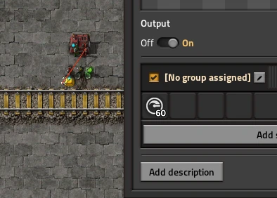

# JD's Speed Limits
A Factorio mod to limit the speed of trains on certain sections of track.

## Introduction
Fast trains are dangerous, especially in busy areas. How many times have you been walking about your base, stepped onto the railway at the wrong time, and been squished by a train moving at 300 km/h, with no time to react? No longer!

With JD's Speed Limits you can slow trains down as they come into busy areas of your base, and let them speed back up when they get to the mainline!

## Usage
To set a speed limit, connect a rail signal to a combinator, and set the "Speed" signal. The value of the signal is the speed limit in km/h.

Trains on a path through the signal will decelerate as they approach the new speed limit, and continue at that speed until they get a new speed limit. Trains passing a sign with a limit higher than their current speed limit won't accelerate until the entire train has passed the sign.

Trains decelerating to or maintaining a reduced speed will use proportionally less fuel than if they were accelerating.
